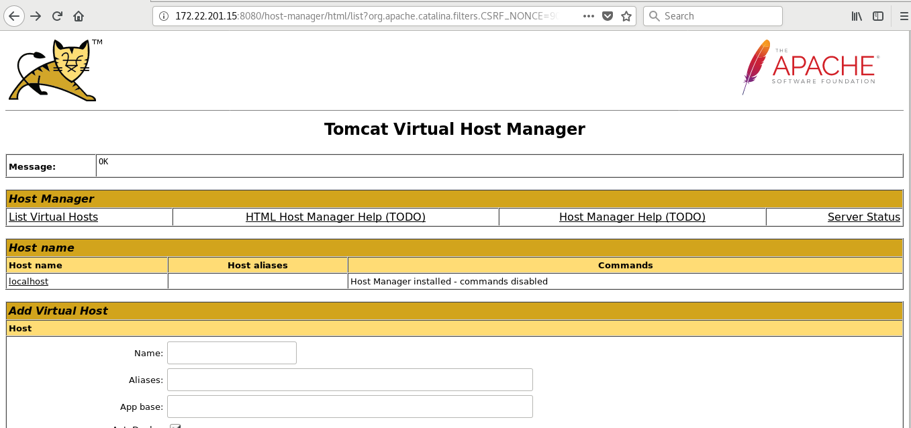

# Introducción a Tomcat 8

En el siguiente documento se explicará como implantar un contenedor de servlets Tomcat versión 8 en un sistema Linux Debian Stretch.

## Instalación

Para instalar tomcat8 desde repositorios:
	
	# apt install tomcat8

Por dependecia va a instalar el paquete `openjdk-8-jre-headless`, que corresponde a una implementación de la JVM mínima para poder ejecuar nuestros programas java.

Desde este momento tendremos Tomcat ejecutandose y sirviendo en el puerto 8080.

Para gestionar el servicio tomcat:

	# systemctl stop|start|restart|status tomcat8

Si estamos instalando tomcat8 en una instancia de OpenStack, y por las limitaciones de las máquinas virtuales en la generación pseudoaleatoria, es necesario modificar el fichero `/usr/lib/jvm/java-7-openjdk-amd64/jre/lib/security/java.security`, y cambiar la siguiente línea:

	securerandom.source=file:/dev/./urandom

Trás el cambio reinciamos el servicio.

## Administración

Esta sección la iniciaremos utilizando una herramienta que nos proporciona la fundación Apache y que nos facilita el despliegue de aplicaciones y manejo del servidor, Tomcat-Manager. Para instalarlo:

	# apt install tomcat8-admin

Una vez instalado debemos crear un usuario con el rol manager para acceder a él. Añadimos una línea similar a la siguiente al fichero `/etc/tomcat6/tomcat-users.xml`:

	<role rolename="manager-gui"/>
	<user username="tomcat" password="s3cret" roles="manager-gui"/>

Para acceder a la zona de administración:

 
## Despliegue de aplicaciones mediante la interfaz web

Utilizaremos la herramienta anterior para explicar cómo desplegar una aplicación, por ejemplo .war. Simplemente bajamos con el scroll hasta encontrar una sección llamada "WAR file to deploy". Seleccionamos el fichero .war y le damos al botón "Deploy".

Puedes bajarte el fichero war desde el siguiente [enlace](war/RequestDispatcher.war).

Automáticamente se creará un nuevo elemento en la sección aplicaciones utilizando el mismo
nombre que el fichero .war subido.

Desde aquí podremos controlar la aplicación (Arrancarla, pararla, eliminarla,...)

## Despliegue de aplicaciones mediante la terminal

Implantar una aplicación desde la terminal, tampoco es tan dificíl, ya que por defecto cualquier fichero .war que se copie o mueva dentro de l directorio /var/lib/tomcat8/webapps/ se desplegaría automáticamente y dependiendo de nuestra configuración se lanzaría o no.

## Administración desde la terminal

Es hora de hablar de los ficheros de configuración. El más importante es `/etc/tomcat8/server.xml`, cuyo contenido define cómo está formado nuestro servidor. Las secciones más importente de este fichero son:

* Componente Server
		
		<Server port="8005" shutdown="SHUTDOWN"> ... </Server>

	* port : Indica el puerto al que se enviaría el comando shutdown.
	* shutdown : Indica la cadena de texto que se enviaría al puerto indicado anteriormente para apagar el servidor.

* Componente Service
  
		<Service name="Catalina"> ... </Service>
	
	* name: Nombre utilizado en los ficheros de log, administración y gestión, debe ser distínto para cada service.

* 

